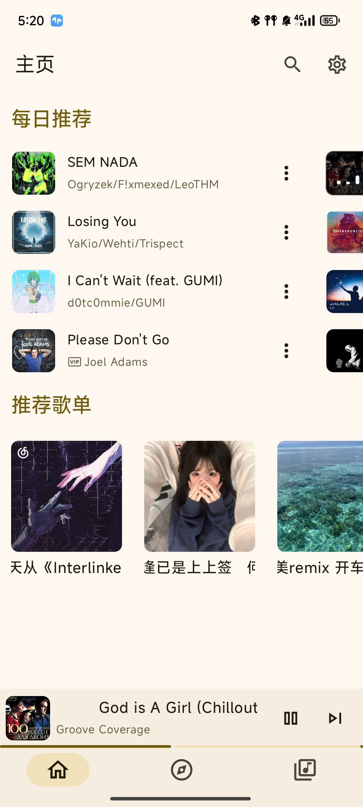
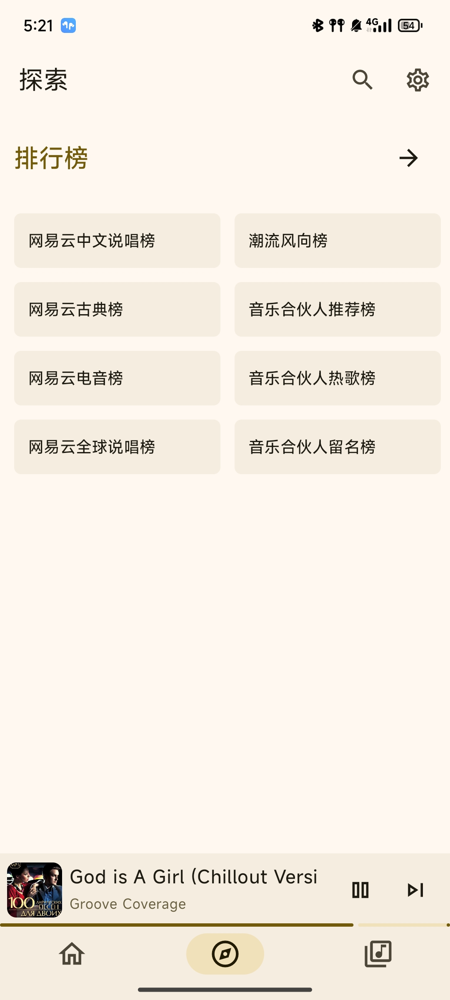
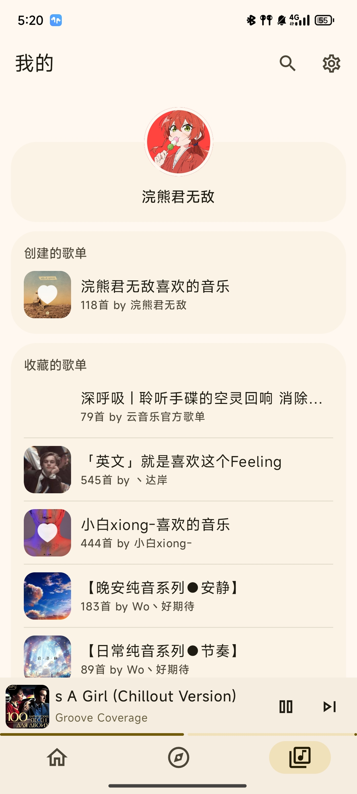
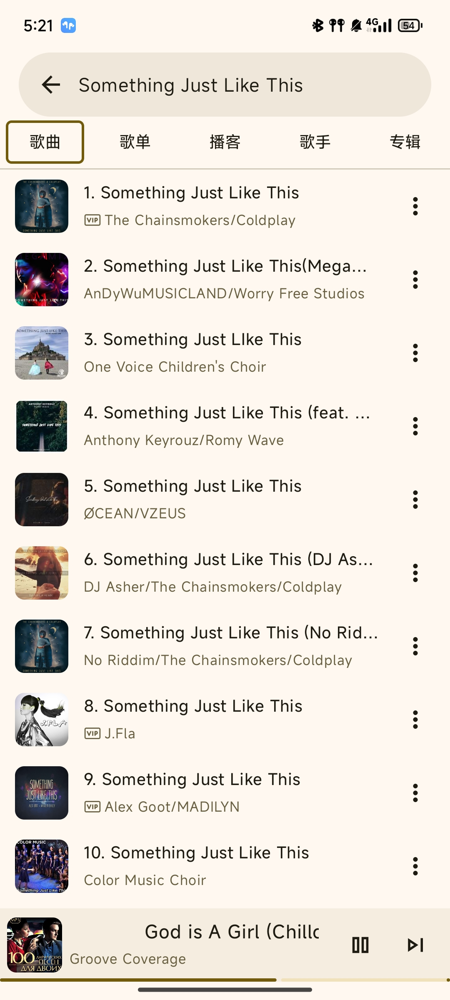
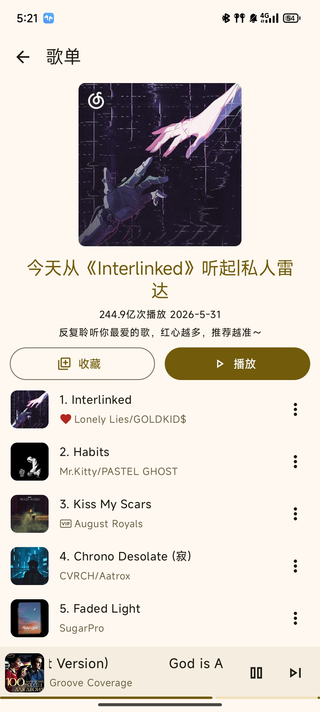

# Mooic

  

<h1 align="center">Mooic</h1>

  一个基于 Material 3 设计的 Android 网易云音乐客户端

  
  
  

## 说明

- 本项目为本人个人项目，仅用于个人学习研究，请勿用于商业用途。
- 本项目大部份界面和功能直接参考了 [JetMelo](https://github.com/rcmiku/JetMelo), api接口来自网络搜集
- 本项目代码都是英文字母的随机组合,不代表个人观点

## 功能特性

- 播放网易云音乐歌曲
- 支持使用自建api服务
- 后台播放占用极低
- 搜索网易云音乐中的歌曲、专辑和歌单
- 支持登录
- 支持同步歌词
- 提供个性化推荐

## 截图

<table>
  <tr>
    <td></td>
    <td></td>
    <td></td>
  </tr>
  <tr>
    <td></td>
    <td></td>
    <td></td>
  </tr>
</table>

## 致谢
- [JetMelo](https://github.com/rcmiku/JetMelo)
- [InnerTune](https://github.com/z-huang/InnerTune)
- [Protobuf](https://github.com/protocolbuffers/protobuf)
- [Reorderable](https://github.com/Calvin-LL/Reorderable)
- [Ktor](https://github.com/ktorio/ktor)
- [Coil](https://github.com/coil-kt/coil)
- [Ksp](https://github.com/google/ksp)

## 免责声明

本软件与网易云音乐、杭州网易云音乐科技有限公司及其任何关联公司不存在隶属、资助、授权或认可关系。

本软件不提供任何 VIP 音频解密或解锁服务。访问相关内容前，你需要在对应平台取得合法会员资格。

本软件仅供学习与交流使用，不得用于商业用途。

本软件中涉及的任何商标、服务标记、商号或其他知识产权，均归其各自权利人所有。
